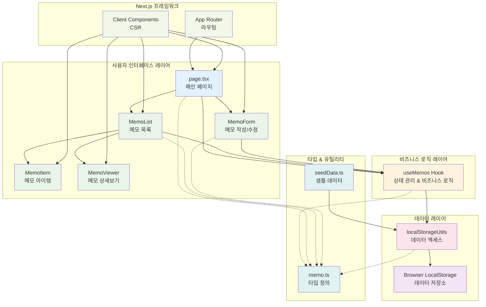

# 메모 앱 시스템 아키텍처

## 개요

Next.js 기반의 클라이언트 사이드 메모 관리 애플리케이션으로, 로컬스토리지를 데이터 저장소로 사용하는 SPA 구조입니다.

## 시스템 아키텍처 다이어그램

## 컴포넌트별 역할

### UI 컴포넌트
- **page.tsx**: 애플리케이션의 메인 페이지, 전체 레이아웃과 상태 관리
- **MemoList**: 메모 목록 표시, 검색/필터링 기능
- **MemoForm**: 메모 생성/수정 폼 (모달 방식)
- **MemoItem**: 개별 메모 카드 표시
- **MemoViewer**: 메모 상세 보기 (읽기 전용)

### 비즈니스 로직
- **useMemos Hook**: 메모 CRUD, 검색, 필터링, 통계 등 모든 비즈니스 로직 관리

### 데이터 레이어
- **localStorageUtils**: 브라우저 로컬스토리지와의 인터페이스
- **Browser LocalStorage**: 실제 데이터 저장소

### 지원 요소
- **memo.ts**: 타입 정의 (Memo, MemoFormData, Category 등)
- **seedData.ts**: 초기 샘플 데이터 생성

## 주요 데이터 플로우

1. **메모 생성**: UI → useMemos → localStorageUtils → LocalStorage
2. **메모 조회**: LocalStorage → localStorageUtils → useMemos → UI
3. **메모 수정**: UI → useMemos → localStorageUtils → LocalStorage
4. **메모 삭제**: UI → useMemos → localStorageUtils → LocalStorage
5. **검색/필터링**: UI → useMemos (메모리 내 필터링)

## 기술 스택

- **Frontend**: Next.js 15, React 19, TypeScript
- **스타일링**: Tailwind CSS
- **상태 관리**: React Hooks (useState, useEffect, useMemo, useCallback)
- **데이터 저장**: Browser LocalStorage
- **테스팅**: Playwright
- **개발 도구**: ESLint, Prettier

## 특징

- **클라이언트 사이드 앱**: 별도 백엔드 없이 브라우저에서 완전 동작
- **실시간 검색**: 메모리 내에서 즉시 검색/필터링
- **반응형 UI**: Tailwind CSS 기반 모바일 친화적 인터페이스
- **타입 안전성**: TypeScript로 완전한 타입 안전성 보장
- **컴포넌트 재사용**: 모듈화된 컴포넌트 구조

## 확장 가능성

- 백엔드 API 연동을 위한 데이터 레이어 추상화 준비
- PWA 기능 추가 가능
- 실시간 동기화 기능 확장 가능
- 파일 첨부, 이미지 지원 등 확장 기능 추가 가능